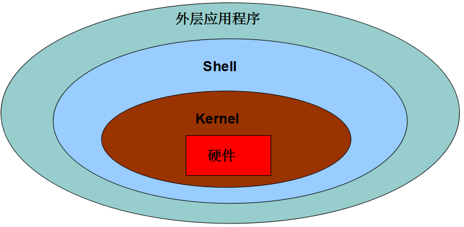
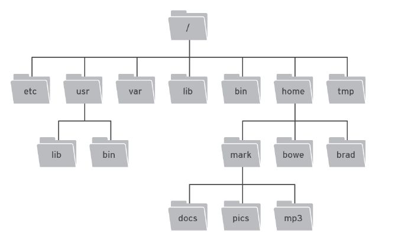

## Linux入门

### 操作系统

操作系统(Operation System,OS)是**管理硬件**和**控制软件**运行的计算机程序

### 操作系统的种类

- 桌面操作系统
- 移动操作系统
- 服务器操作系统
- 嵌入式设备操作系统

### linux基本介绍

1. 1973 年, 肯·汤普逊和丹尼斯·里奇 开发了 Unix 操作系统.
2. 1987 年, 塔能鲍姆 发布了 Minix 操作系统.
3. 1994年3月, 林纳斯 发布了 Linux 1.0.

Linux（林纳克斯）作者：Linus莱纳斯

**优点:**Linux 操作系统应用在服务器领域、嵌入式领域1.安全、稳定、免费 2.占有率高市场
**缺点:**在桌面操作系统中占有率低,应用软件少

**Linux内核**
内核是一个操作系统的核心. 它负责管理系统的进程、内存、设备驱动程序、文件和网络系统，决定着系统的性能和稳定性.



**Linux 发行版**
包括 Linux 内核、命令行 SHELL、图形界面, 并包含数千种办公套件, 编译器, 文本编辑器等应用软件.

**Ubuntu** 
优点：免费, 易于安装使用, 市场占用率较高
**虚拟机**（Virtual Machine）
通过软件模拟的具有完整硬件系统功能的、运行在一个万千隔离环境中的完整的的计算机系统。

**Linux 和 Windows 文件系统的区别** 

   	1. Linux 文件系统只有一个根目录(/) 
   	2. Windows 文件系统会有可能会有多个盘符(例如C、D、E...)

**系统资源目录**

绝对路径：以 `/` 开始的路径，例如: /home/用户名
相对路径：`./` （表示当前目录）

**Linux 目录结构示意图**

	

### 主要目录速查表

- /：根目录，

  一般根目录下只存放目录

  在 linux 下有且只有一个根目录，所有的东西都是从这里开始

  - 当在终端里输入 `/home`，其实是在告诉电脑，先从 `/`（根目录）开始，再进入到 `home`目录

- /bin、/usr/bin：可执行二进制文件的目录，如常用的命令 ls、tar、mv、cat 等

- /boot：放置 linux 系统启动时用到的一些文件，如 linux 的内核文件：`/boot/vmlinuz`，系统引导管理器：`/boot/grub`

- /dev：存放linux系统下的设备文件，访问该目录下某个文件，相当于访问某个设备，常用的是挂载光驱`mount /dev/cdrom /mnt`

- /etc：系统配置文件存放的目录，不建议在此目录下存放可执行文件，重要的配置文件有

  - /etc/inittab
  - /etc/fstab
  - /etc/init.d
  - /etc/X11
  - /etc/sysconfig
  - /etc/xinetd.d

- /home：系统默认的用户家目录，新增用户账号时，用户的家目录都存放在此目录下

  - `~` 表示当前用户的家目录
  - `~edu` 表示用户 `edu` 的家目录

- /lib、/usr/lib、/usr/local/lib：系统使用的函数库的目录，程序在执行过程中，需要调用一些额外的参数时需要函数库的协助

- /lost+fount：系统异常产生错误时，会将一些遗失的片段放置于此目录下

- /mnt: /media：光盘默认挂载点，通常光盘挂载于 /mnt/cdrom 下，也不一定，可以选择任意位置进行挂载

- /opt：给主机额外安装软件所摆放的目录

- /proc：此目录的数据都在内存中，如系统核心，外部设备，网络状态，由于数据都存放于内存中，所以不占用磁盘空间，比较重要的文件有：/proc/cpuinfo、/proc/interrupts、/proc/dma、/proc/ioports、/proc/net/* 等

- /root：系统管理员root的家目录

- /sbin、/usr/sbin、/usr/local/sbin：放置系统管理员使用的可执行命令，如 fdisk、shutdown、mount 等。与 /bin 不同的是，这几个目录是给系统管理员 root 使用的命令，一般用户只能"查看"而不能设置和使用

- /tmp：一般用户或正在执行的程序临时存放文件的目录，任何人都可以访问，重要数据不可放置在此目录下

- /srv：服务启动之后需要访问的数据目录，如 www 服务需要访问的网页数据存放在 /srv/www 内

- /usr：应用程序存放目录

  - /usr/bin：存放应用程序可执行二进制文件的目录
  - /usr/share：存放共享数据
  - /usr/lib：存放不能直接运行的，却是许多程序运行所必需的一些函数库文件
  - /usr/local：存放软件升级包
  - /usr/share/doc：系统说明文件存放目录
  - /usr/share/man：程序说明文件存放目录

- /var：放置系统执行过程中经常变化的文件

  - /var/log：随时更改的日志文件
  - /var/spool/mail：邮件存放的目录
  - /var/run：程序或服务启动后，其 PID 存放在该目录下

**重点:** **/home/用户名** 是用户的家目录.

### Linux命令操作

在工作中，大量的 **服务器维护工作** 都是在 **远程** 通过 **SSH 客户端** 来完成的，并没有图形界面，所有的维护工作都需要通过命令来完成。如 **磁盘操作**、**文件存取**、**目录操作**、**进程管理**、**文件权限** 设定等.

#### 10个基本命令

| 序号 | 命令          | 对应英文             | 作用                             |
| ---- | ------------- | -------------------- | -------------------------------- |
| 01   | ls            | list                 | 查看当前文件夹下的内容           |
| 02   | pwd           | print wrok directory | 查看当前所在文件夹               |
| 03   | touch[文件名] | touch                | 如果文件不存在，新建文件         |
| 04   | mkdir[目录名] | make directory       | 创建目录 //-p可递归创建目录      |
| 05   | rm[文件名]    | remove               | 删除指定的文件                   |
| 06   | cd[目录名]    | change directory     | 切换文件夹                       |
| 07   | cp[文件名]    | copy                 | 拷贝指定的文件 //拷贝文件夹用-r  |
| 08   | mv[文件名]    | move                 | 移动指定文件//移动文件夹不用加-r |
| 09   | tree[目录名]  | tree                 | 以树状方式显示目录结构           |
| 10   | clear         | clear                | 清屏                             |

01.ls扩展

- ls -a可显示隐藏文件
- ls -l显示详细信息
- ls -h显示文件大小
- ls -l -h 显示详细信息和大小
- ll 显示详细信息（信息更多）

05.rm扩展

- rm -i 交互式执行
- rm -f 强制删除，忽略不存在的文件，无需提示
- rm -r 递归地删除目录下的内容，删除文件夹时必须加此参数
- rm -d 删除空目录

06 cd扩展

- cd  切换到当前用户的主目录(/home/用户目录)
- cd ~  切换到当前用户的主目录(/home/用户目录)
- cd . 切换到当前目录
- cd .. 切换到上级目录
- cd -可进入上次所在的目录

07.cp扩展

- cp -a 该选项通常在复制目录时使用，它保留链接、文件属性，并递归地复制目录，简单而言，保持文件原有权限。
- cp -i 交互式复制，在覆盖目标文件之前将给出提示要求用户确认
- cp -r 若给出的源文件是目录文件，则cp将递归复制该目录下的所有子目录和文件，目标文件必须为一个目录名。
- cp -v 显示拷贝后的路径描述

08.mv扩展

- mv -i 确认交互方式操作，如果mv操作将导致对已存在的目标文件的覆盖，系统会询问是否重写，要求用户回答以避免误覆盖文件		
- mv -v 显示移动后的路径描述

**Tips:**

1. `ctrl` + `shift` `+` **放大**终端窗口的字体显示
2. `ctrl` + `-` **缩小**终端窗口的字体显示
3. 敲出 文件／目录／命令 的前几个字母之后, 按下 **tab 键**可以进行名称自动补全.
   如果还存在其他 文件／目录／命令, **再按一下 tab 键**, 会提示可能存在的命令.
4. 按 `上`／`下` 光标键可以在使用过的命令之间切换.
5. 如果想要退出选择, 并且不想执行当前选中的命令, 可以按 **ctrl + c**

### Linux 终端命令格式

```bash
command [-options] [parameter]
命令     []选项,可选  参数,对谁做,0或多个
```

**--help选项**

```bash
command --help
```

显示 **command** 命令的帮助信息

**man 命令**

```bash
man command
```

**man** 是 **manual** 的缩写, 是 Linux 提供的一个 **手册**, 包含了绝大部分的命令的详细使用说明.

| 操作键   | 功能                 |
| -------- | -------------------- |
| 空格键   | 显示手册页的下一屏   |
| Enter 键 | 一次滚动手册页的一行 |
| b        | 回滚一屏             |
| f        | 前滚一屏             |
| q        | 退出                 |
| /word    | 搜索 **word** 字符串 |

#### 重定向

将命令执行结果重定向到一个文件，本应显示在终端上的内容保存到指定文件中.

- `ls > test.txt` ( test.txt 如果不存在，则创建，存在则覆盖其内容 )

#### 查看或者合并文件内容

- cat test.txt
- cat test1.txt text2.txt >test.txt   //把两个文件的内容重新定向到test.txt文件中
- cat test1.txt text2.txt >>test.txt     //>表示先清空后添加，>>表示直接添加

#### 分屏显示

- `more`  //空格键可以显示下一页，按下q键退出显示，按下h键可以获取帮助

#### 管道

- `|` 左端塞东西(写)，右端取东西(读)

#### 建立链接文件

语法: ln

- 软链接 `ln -s 源文件 链接文件`  //软链接不占用磁盘空间，源文件删除则软链接失效。
- 硬链接 `ln 源文件 链接文件`  //硬链接只能链接普通文件，不能链接目录。

#### 文本搜索

语法: grep  

//grep允许对文本文件进行模式查找。如果找到匹配模式， grep打印包含模式的所有行。

例子: grep 'a' 1.txt 

- -v  显示不包含匹配文本的所有行（相当于求反）
- -n  显示匹配行及行号
- -i   忽略大小写

可以用的正则表达式规则为：`^`,`$`,`[ ]`, `.`  //匹配行首、行尾、[ ]中字符的任意一个、任意非换行符的字符

#### 查找文件

- find ./ -name test.sh		查找当前目录下所有名为test.sh的文件
- find ./ -name '*.sh'	    查找当前目录下所有后缀为.sh的文件
- find ./ -name "[A-Z]*"   查找当前目录下所有以大写字母开头的文件

可用的正则表达式：*,?,[ ]   // 代表0个或多个任意字符,代表任意一个字符

#### 打包及压缩

**语法:tar**

- -c	生成档案文件，创建打包文件
- -v	列出归档解档的详细过程，显示进度
-  -f	指定档案文件名称，f后面一定是.tar文件，所以必须放选项**最后**
-  -x	解开档案文件
- -z	压缩

##### gz压缩格式

- 压缩：tar -zcvf test.tar.gz A  //把A打包压缩为test.tar.gz文件
- 解压：tar -zxvf test.tar.gz  -C B  //把test.tar.gz文件解压到B中
  - **解压到指定目录：-C （大写字母“C”）**

##### bz2 压缩格式

- 压缩： tar -jcvf 压缩包包名 文件
- 解压： tar -jxvf 压缩包包名

##### zip 压缩格式

- 压缩：zip 目标文件(没有扩展名) 源文件
- 解压：unzip -d 解压后目录文件 压缩文件

#### 修改文件权限

**字母法**

- chmod u/g/o/a +/-/= rwx 文件  

| [ u/g/o/a ] | 含义                                                      |
| ----------- | --------------------------------------------------------- |
| u           | user 表示该文件的所有者                                   |
| g           | group 表示与该文件的所有者属于同一组( group )者，即用户组 |
| o           | other 表示其他以外的人                                    |
| a           | all 表示这三者皆是                                        |

| [ +-= ] | 含义     |
| ------- | -------- |
| +       | 增加权限 |
| -       | 撤销权限 |
| =       | 设定权限 |

如果需要同时进行设定拥有者、同组者以及其他人的权限，可以写为:

`chmod u=rw,g=x,o=r 1.txt`

之后用`ls -lh`进行查看

**数字法**

- r	读取权限，数字代号为 "4"
- w	写入权限，数字代号为 "2"
- x	执行权限，数字代号为 "1"

如果想递归所有目录加上相同权限，需要加上参数“ -R ”

例如:`chmod 777 test/ -R` 递归 test 目录下所有文件加 777 权限

#### 查看命令位置：

`which + 命令`(如果找不到命令,就不会执行)

#### 切换到管理员账号：

`sudo -s`  切换到root

$ 表示普通用户
#表示root用户

#### 查看当前用户：

`whoami`

#### 设置用户密码

`sudo passwd xxxx `修改密码为xxxx

#### 退出登录账户： 

`exit`

- 如果是图形界面，退出当前终端；
- 如果是使用ssh远程登录，退出登陆账户；
- 如果是切换后的登陆用户，退出则返回上一个登陆账号。

####  查看所有的登录用户

`who` 查看当前所有登录系统的用户信息。

#### 关机重启

| 命令              | 含义                                       |
| ----------------- | ------------------------------------------ |
| reboot            | 重新启动操作系统                           |
| shutdown –r now   | 重新启动操作系统，shutdown会给别的用户提示 |
| shutdown -h now   | 立刻关机，其中now相当于时间为0的状态       |
| shutdown -h 20:25 | 系统在今天的20:25 会关机                   |
| shutdown -h +10   | 系统再过十分钟后自动关机                   |

